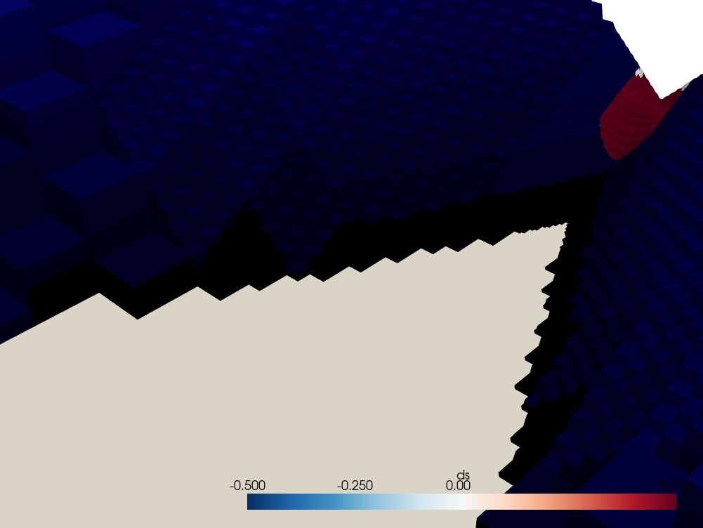
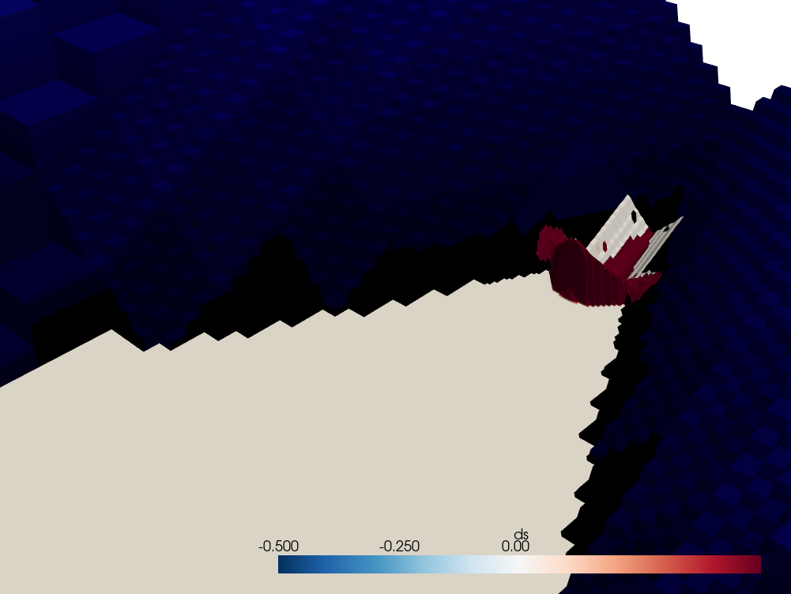
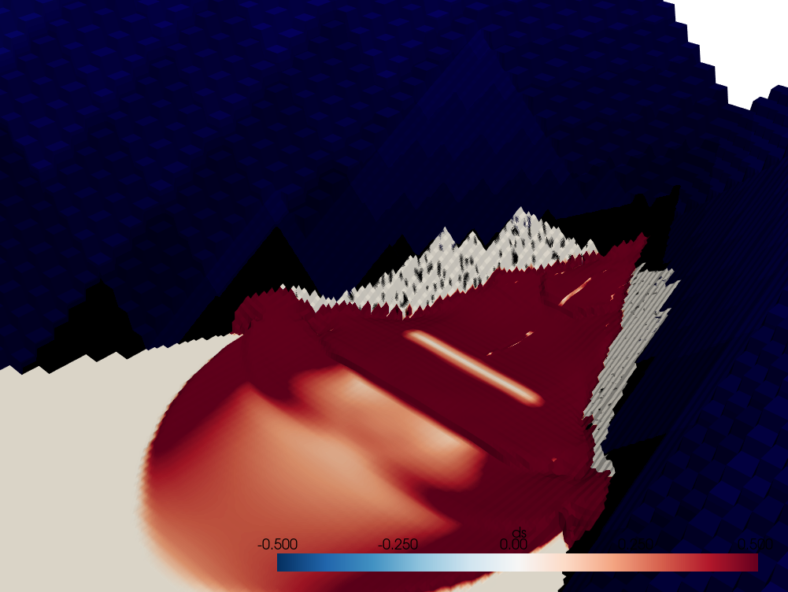

# Introduction

An avalanche generates an *impulse wave* when it strikes a body of water such as a lake.
This wave may damage areas near or downstream of the lake depending on its amplitude.
Although it seems like a distant and excessively rare phenomenon, thousands of people have been killed in recent history \citep{Vajont,Palcacocha} and even the Léman's tsunami in the year 563 might have been caused by an impulse wave.

Recent small-scale experiments have studied the effects of the avalanche's characteristics on the wave's shape. We hereby complement the recent studies by addressing the effect of topography.

# State of the art

Previously, the only method available to estimate the height of an impulse wave was an empirical relation ([large and laboratory scale experiments](https://www.youtube.com/watch?v=QHvx1SKdqcw)), derived from dimensional analysis and focused on heavy flows such as landslides and debris flows [@heller].
This relation has led to unrealistic predictions in engineering.

> 
> 
> {#simulation}
> **Numerical simulation of an impulse wave showing the free-surface elevation variation at times $t=1.1~\mathrm{s}$, $t=2.2~\mathrm{s}$ and $t=7.8~\mathrm{s}$.**

Given this failure, an alternate method was proposed to estimate the height of impulse waves, in the particular case of snow avalanches [@giboul].
It assumes a sudden transformation of the snow into water, a supercritical flow (where advection is faster than diffusion) and relies on a numerical solver to account for a complex topography. This differs from the scaled experiments in the sense that they could only test basic topographies.
This method was applied to the future Trift dam [@manso] to forecast the impulse waves and ensure they will not jump over the dam and destroy the valley. It will serve as the ground truth to our study.

# Objective

In this project, we put aside the avalanche's details to focus on the effect of topography. To that end, we simulate avalanches with a numerical model [@giboul] with varying slope, curvature (vertically) and combe openness.

# Dimensional analysis

In straight flumes, it has been established that the ratio $h_\mathrm{avalanche}/h_\mathrm{wave}^\mathrm{max}$ scales as

$$
\left(\frac{h_\mathrm{avalanche}}{h_\mathrm{wave}^\mathrm{max}}\right)^{5/4} = \frac{4}{9}\frac{u}{\sqrt{g h}}\cdot\sqrt{\frac{h_s}{h}}\cdot\sqrt[4]{\frac{V_s}{w \ell_s h}}\cdot\sqrt{\cos \phi}
$$

We wish to extend this result to more complex topographies like narrow paths. To that end, we consider not a straight slope but one with vertical curvature $\varsigma$ and a bottleneck angle $\beta$. They are introduced as dimensionless variables and simply appended to the product.

$$
\eta_{\max} = \frac{h_\mathrm{wave}^\text{max}}{h_\mathrm{avalanche}} \propto \mathrm{Fr}^a \cdot \left(\cos\phi\right)^b \cdot \left(\tan{\beta}\right)^c \cdot \varsigma^d \cdot \left(\frac{h_s}{h}\right)^e \cdot \left(\frac{V_s}{V_\ast}\right)^f
$$

However, as avalanches should follow scale-invariance, a single avalanche volume is implemented. Moreover, the characteristic depth $h$ is meaningless for curved topographies. The same stands for the relative depth $h_s/h$. For the same reason, Froude's number has to be redefined, the avalanche's Froude number is chosen $\mathrm{Fr}_s \doteq u / \sqrt{gh_s}$. Finally, we are interested in finding the coefficients of a widely different system :

$$
\eta_{\max} \propto \mathrm{Fr}_s^a \cdot \left(\cos\phi\right)^b \cdot \left(\tan\beta\right)^c \cdot \varsigma^d. \tag{1}
$$

The curvature parameter is arbitrarily set to $\varsigma\doteq R/h_s$ where $R$ is the radius of the circle tangent to the topography.

When working in a log-log framework, this product becomes a linear relationship :

$$
\log\eta_{\max} = \log\eta_0 + a\log\mathrm{Fr}_s+b\log(\cos\phi)+c\log \left(\tan\beta\right)+d\log\varsigma.
$$

> {#bc}
> **Cross-sections of three avalanches (at the boundary condition) with different bottleneck angles $\beta$ but equal mean depths and areas.**

